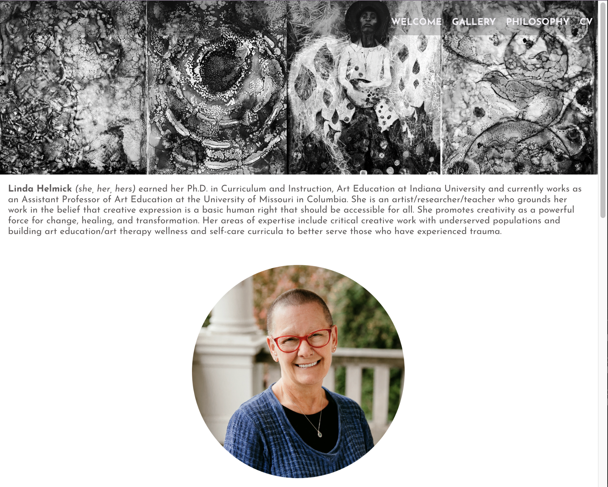
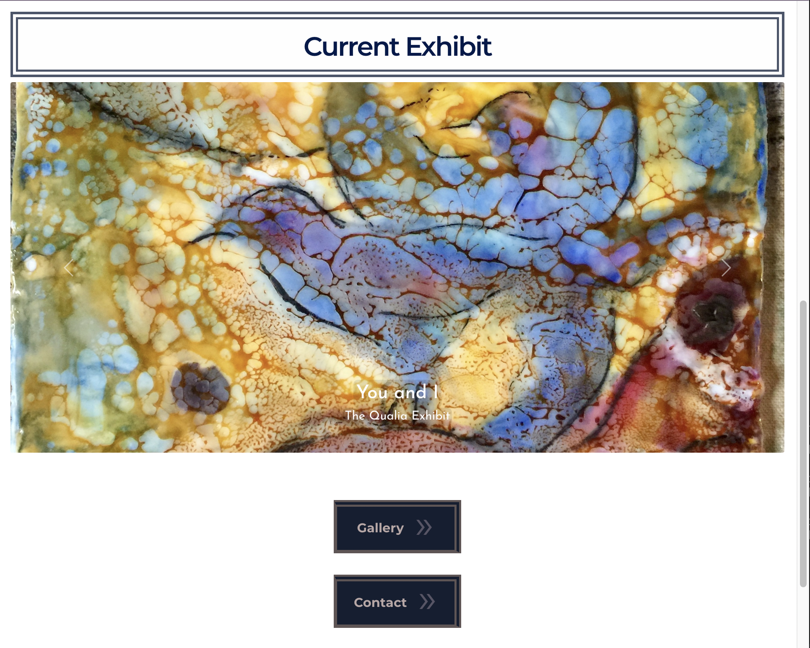

# Artist Homepage & Gallery

## Technologies

- MERN Stack
- Bootstrap

<!-- ## TODO

- add CV info
- render details for artwork
- Get back end running
- connect front end and back end
- deploy

- store pics in cloudinary -- Jon's repo: https://github.com/ocskier/file-upload-multer-cloudinary
-->

<!-- ## To Run Locally for Development

- cd client
- npm install (to update dependencies)
- npm start

 -->
